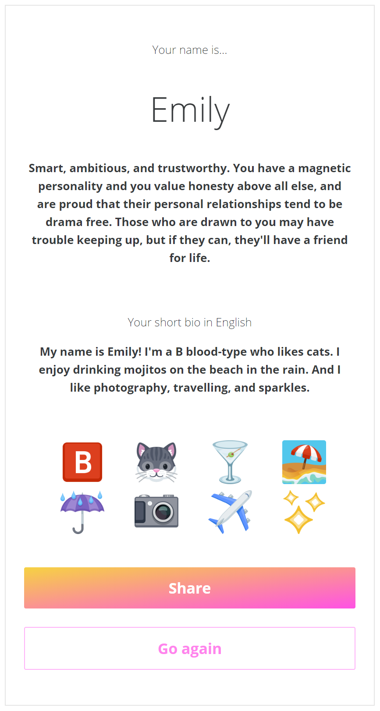
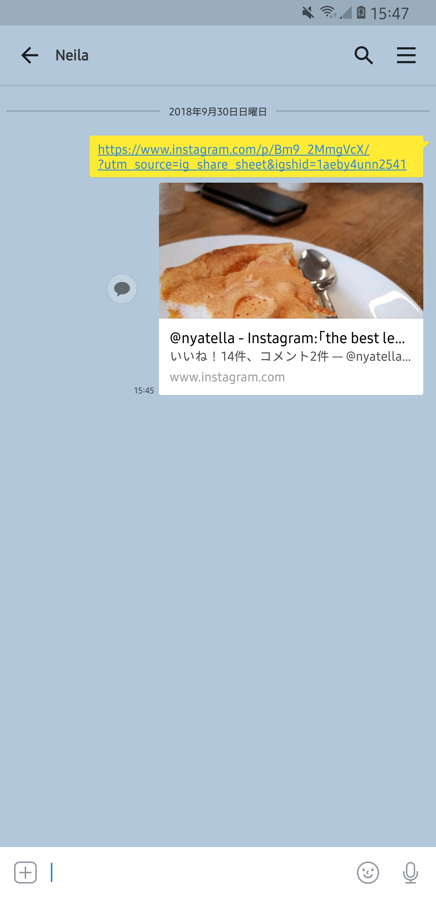

# 🔮 crystal

## 1. Get started
1. Boilerplate from [fastshell](https://github.com/HosseinKarami/fastshell)
2. Check out codebase
3. Follow [installation instructions](https://github.com/HosseinKarami/fastshell/blob/master/DOCS.md)
4. Run with `gulp`

## 2. Methodology
1. All tasks are added as a card on [the Trello board](https://trello.com/b/bzygXNqw/project-crystal-%F0%9F%94%AE)
2. A snapshot is taken on every Monday morning and uploaded to the shared Google Drive directory
3. The ETD (estimated time of development) for each card is no longer than 5 days
4. Each task is sized - XS/S/M/L/XL
5. Code is stored in Bitbucket in logical reasonbly-sized commits
6. Reviews are completed in Bitbucket
5. Unit testing is not required

## 3. Design
1. Every button, on tap, should change in opacity to 0.9 as a clear indication that their button was tapped
2.  All text (except for the loading screen) is i18n configurable, a language file, and should be able to support all languages, should be used in the project, and American-English language phrases are implemented instead of hardcoding the text.
3. On app load, it detects the user's phone language, and then sets that as the language of the app
4. Look and feel is be consistent across modern mobile devices including iPhone 6, Samsung Galaxy S8+, and iPhone X
5. App is deployed in iTunes store and Google Play store

## 4. Splash

1. White text title 'NameMe' is centered

## 5. Landing

1. The colors will possibly be changed
2. image will possibly be changed
3. The phrase here are `landing-prompt` and `start-button`

## 6. Questions
       

1. The question text should be placed in the same position for all questions with less than 8 options as per the mockups
2. The question with 6 options, its text and emojis should be vertically aligned as per the mockups
3. The question text and emojis should be horizontally aligned as per the mockups
4. The spacing between the text and the emojis, between the emojis should be consistent as per the mockups
5. The question with 8 options, its text and emojis should be vertically aligned as per the mockups
6. The phrases here are `gender-question`, `blood-question`, `food-question`, `animal-question`, `weather-question`, `drink-question`, `scenery-question`, `random-question`
7. All questions except for the last one titled 'Pick 3 favorites' should prevent the user from selecting multiple options. When a user taps on an option, it should deselect any selected options. For questions where the user is required to select 1 option, if no options are selected and the 'next button' is tapped, a dismissable error message should appear saying 'Please pick 1' (using the phrase `select-one-error`). The user experience across Android and iOS can be different, it is possible that the [standard iOS Alert](https://developer.apple.com/design/human-interface-guidelines/ios/views/alerts/) or [Android Material Snackbar](https://material.io/design/components/snackbars.html) is used
8. For question 8 titled 'Pick 3 favorites', the user is required to select exactly 3 options. When a deselected option is tapped, it should be selected. When a selected option is tapped, it should be deselected. It allows the user to select any number of emojis, and when they tap the 'next button', if not exactly 3 is selected it should display a dismissable error message consistently, saying 'Please pick 3' (using the phrase `select-three-error`)

## 7. Spinner

1. The phrase here is `calcuating-results-text`
2. Language specific font and styling is required, for example, in Korean there might be text split across multiple lines, and a different font would be used, and the text is still centered
3. If the loading dot animation feature as displayed in the mockup is not feasible, or highly time consuming, it is not necessary, this is implemented last

## 8. Results
 

1. The phrases here are `name-desc`, `short-bio-desc`, `share-button`, and `go-again-button`
2. A random name is chosen from the name CSV file (all CSV files will be provided). Two CSV files will be provided `names-male-v*.csv` and `names-female-v*.csv`. If the user had chosen `female` as their gender, a random name, and the corresponding name description from `names-female-v*.csv` is chosen. If the user had chosen `male` as their gender, a random name, and the corresponding name description from `names-male-v*.csv` is chosen. [Example CSV files](https://github.com/psyanite/crystal/tree/master/app/assets/csv)
3. A `templates-bio-v*.csv` file will also be provided, mapping language to a given biography template. A `templates-emoji-v0.csv` will be provided mapping emoji to the text required in the template. At current stage we will only have English and Korean. Correctly formatted and grammatically correct biography should be generated accordingly to the user's selections from the questions. [Example CSV files](https://github.com/psyanite/crystal/tree/master/app/assets/csv)
4. The blood type, animal, drink, scenery, weather, and the 3 emojis chosen in question 8 the user chose should be displayed in the correct order as per the mockup
5. When the 'Share button' is tapped, as per the native iOS or Android capabilities. The share text is i18n configurable, for example, in English it is 'My English name is <name>. What is yours?' with the phrase `share-text`. the share picture will be the [NameMe logo](https://github.com/psyanite/crystal/blob/master/docs/images/share.PNG). It is shareable to most major platforms such as Facebook, Gmail, Facebook Messenger, Kakaotalk, Whatsapp, Wechat, and LINE. 
6. When the 'Go again button' is tapped, it should redirect back to the landing page with the 'Let's go button'
