# 🔮 crystal

## 1. Get started
1. Boilerplate from [fastshell](https://github.com/HosseinKarami/fastshell)
2. Check out codebase
3. Follow [installation instructions](https://github.com/HosseinKarami/fastshell/blob/master/DOCS.md)
4. Run using `gulp`

## 2. Methodology
1. All tasks are added as a card on the Trello board
2. A snapshot is taken on every Monday morning
3. The ETD (estimated time of development) for each card is no longer than 5 days
4. Each task is sized - XS/S/M/L/XL
5. Unit testing is not required

## 3. Design
* Every button, on tap, should change in opacity to 0.9 as a clear indication that their button was tapped
* All text (except for the loading screen) is i18n configurable, a language file, and should be able to support all languages, should be used in the project, and American-English language phrases are implemented instead of hardcoding the language
* On app load, it detects the user's phone language, and then sets that as the language of the app
* On pages where the user should only select 1, when the user selects another emoji, it should deselect any other options
* On pages where the user should only select 1, when the user clicks on 'next' it should display an error message, 'Please select 1 emoji!'
* On pages where the user must select 3, allow the user to select as many as they like, when they click the 'next' button, if the user has selected less than, or more than 3, display an error message 'Please select 3 emojis!'.
* Look and feel is be consistent across modern mobile devices including iPhone 6, Samsung Galaxy S8+, and iPhone X
* App is deployed in iTunes store and Google Play store

## 4. Splash
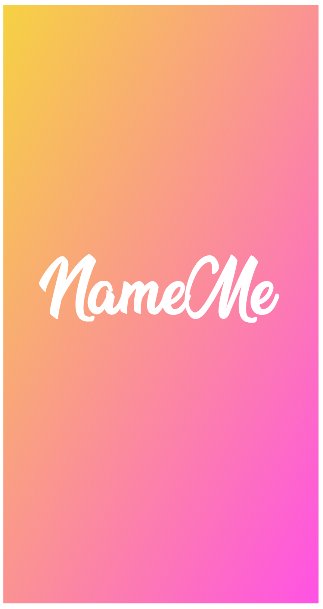
1. White text title 'NameMe' is centered

## 5. Landing
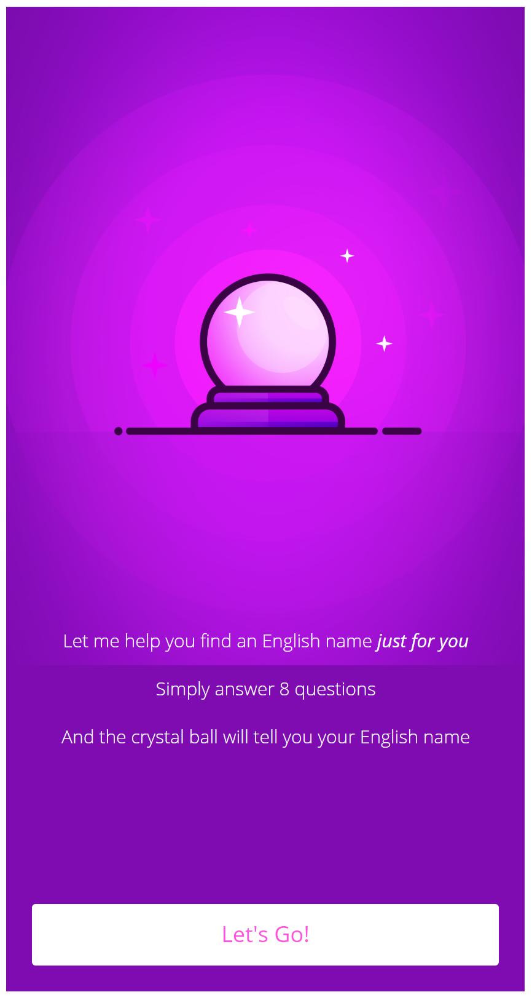
1. The colors will possibly be changed
2. The image will possibly be changed
3. The phrase here are 'landing-prompt' and 'start-button'

## 6. Questions
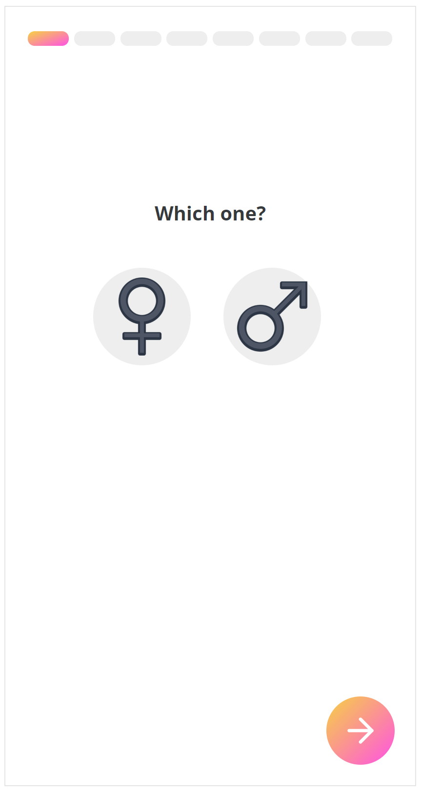 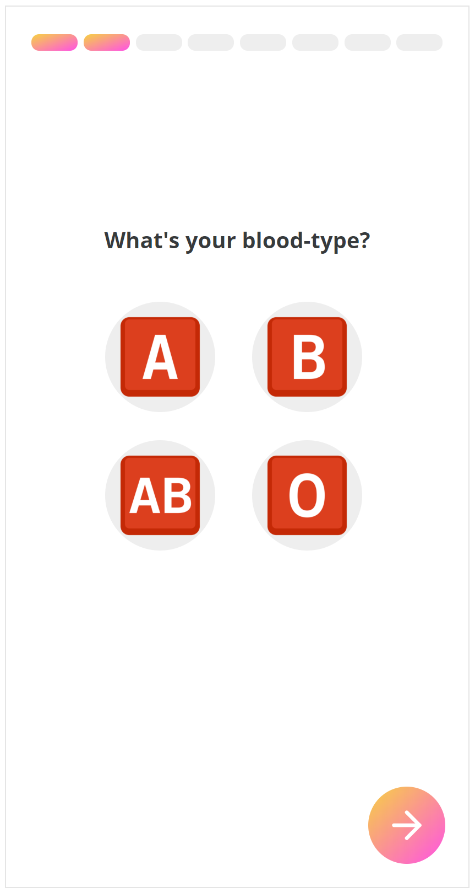 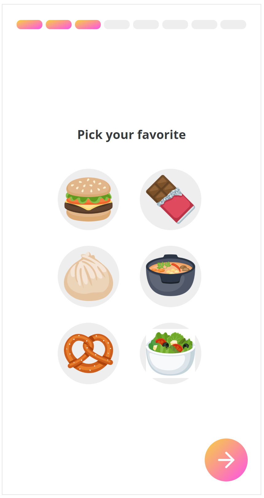 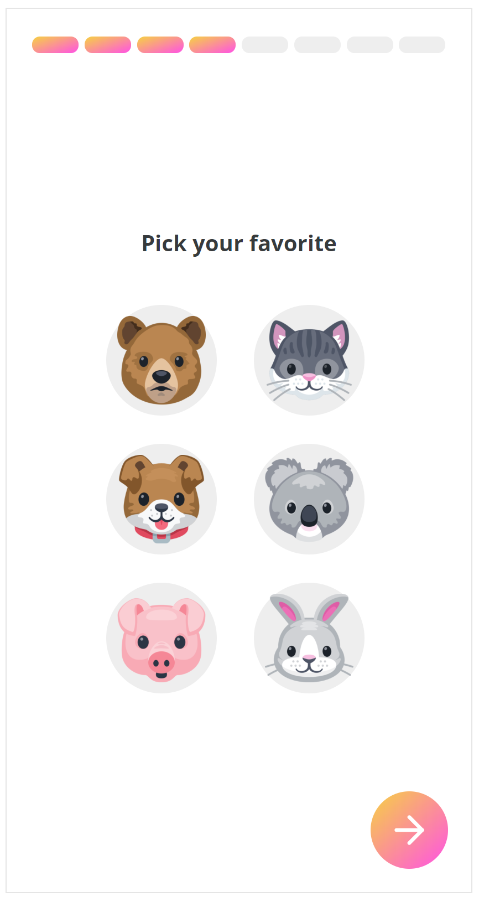 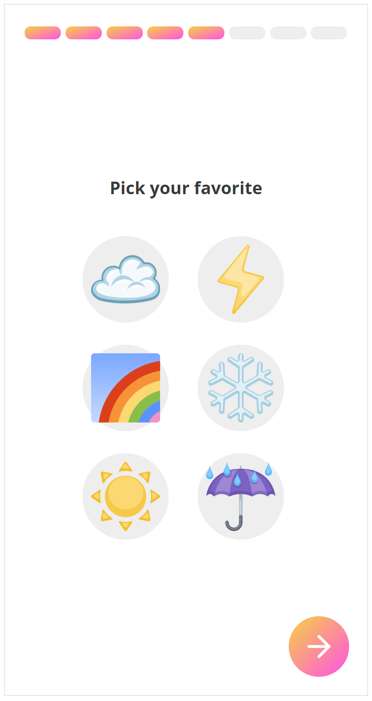 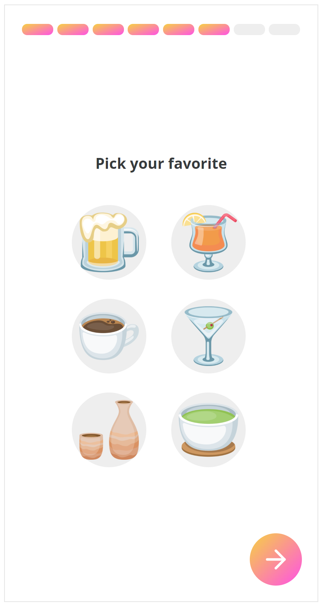 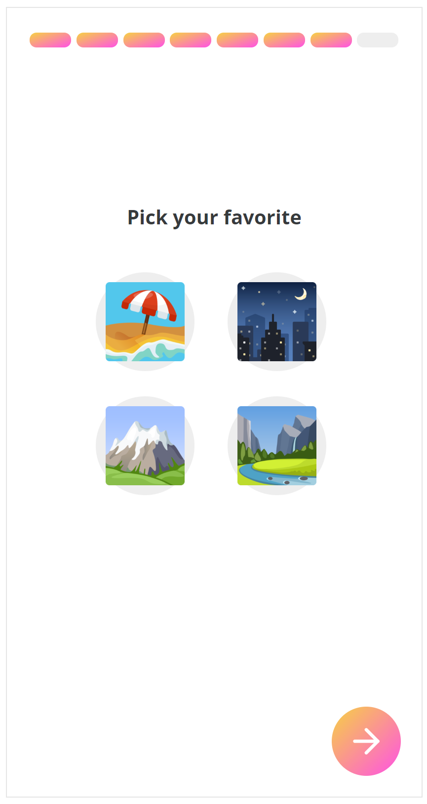 
1. The question text should be placed in the same position for all questions with less than 8 options as per the mockups
2. The question with 6 options, its text and emojis should be vertically aligned as per the mockups
3. The question text and emojis should be horizontally aligned as per the mockups
4. The spacing between the text and the emojis, between the emojis should be consistent as per the mockups
5. The question with 8 options, its text and emojis should be vertically aligned as per the mockups
6. The phrases here are `gender-question`, `blood-question`, `food-question`, `animal-question`, `weather-question`, `drink-question`, `scenery-question`, `random-question`

## 7. Spinner
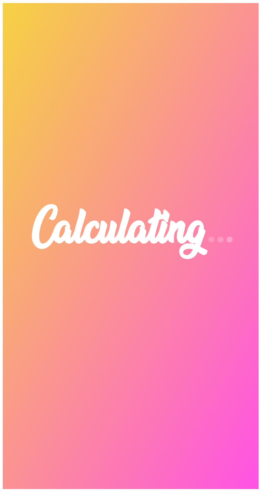
1. The phrase here is 'calcuating-results-text'
2. Language specific font and styling is required, for example, in Korean there might be text split across multiple lines, and a different font would be used
3. If the loading dot animation feature is not feasible, or highly time consuming, it is not necessary, this is implemented last

## 8. Results
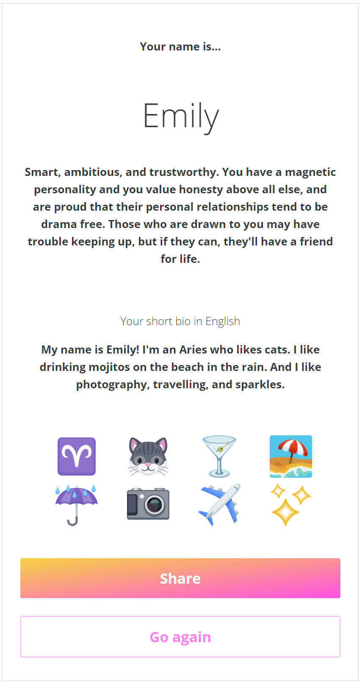
1. The phrases here are `name-desc`, `short-bio-desc`, `share-button`, and `go-again-button`
